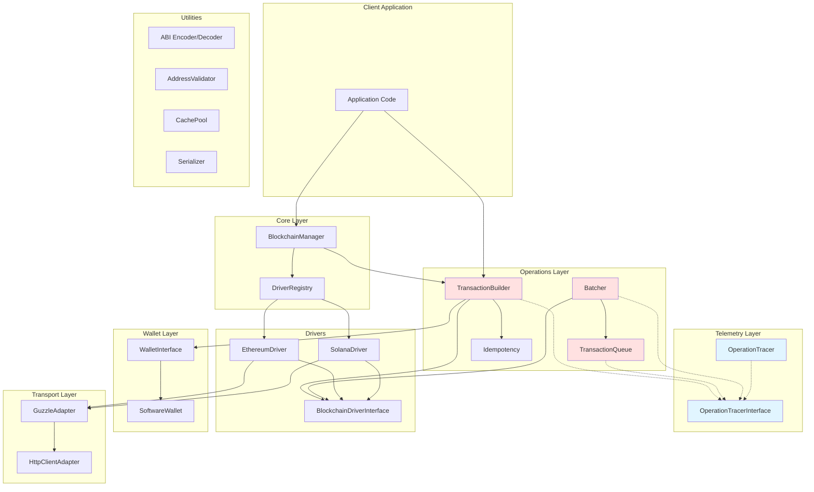
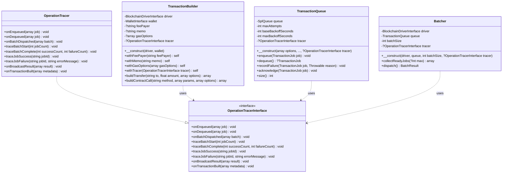
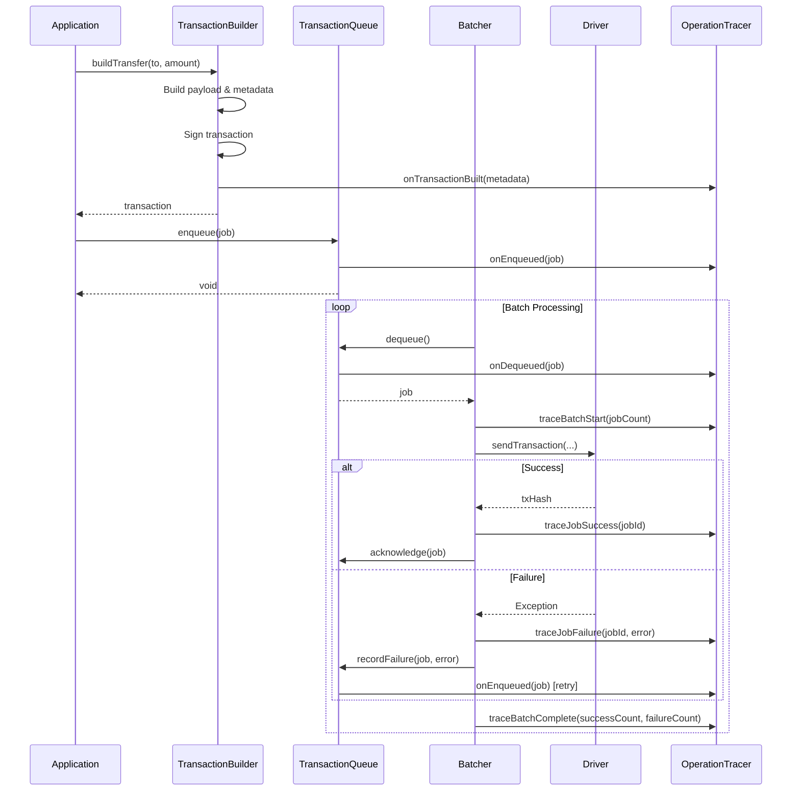
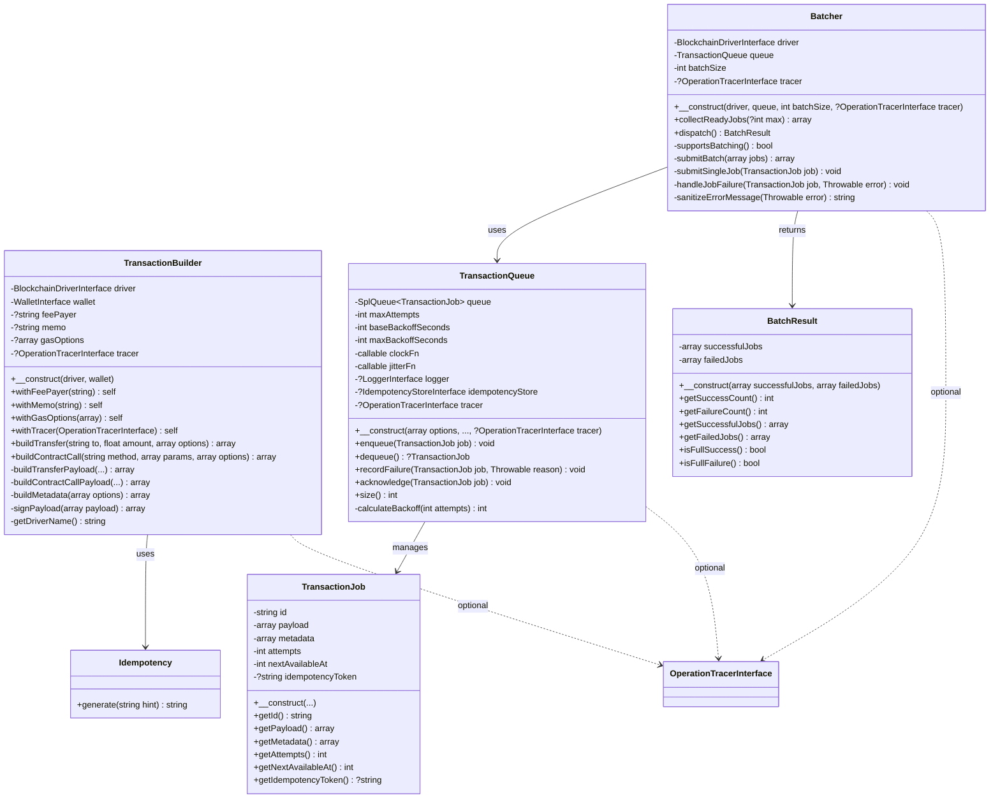
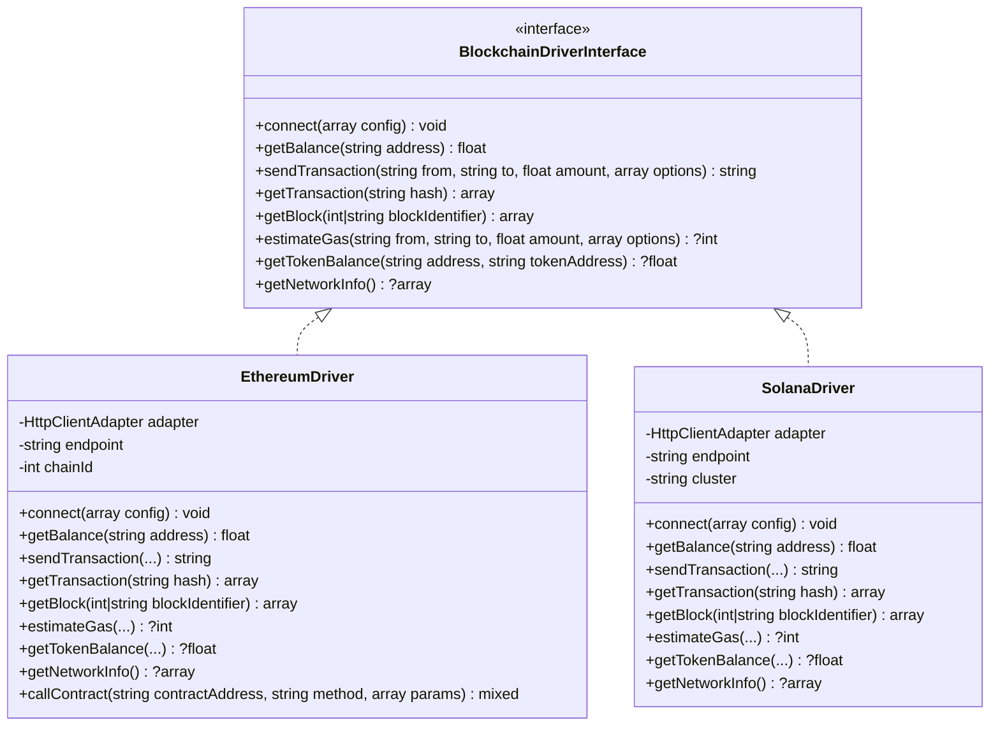
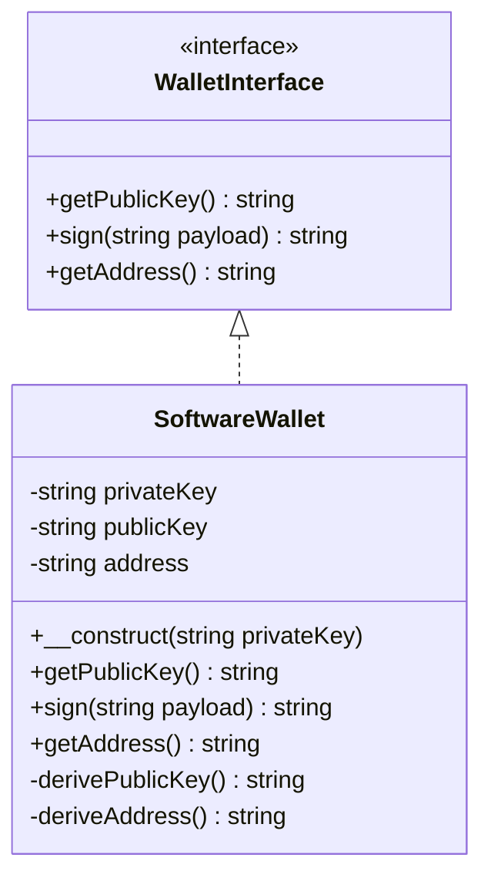
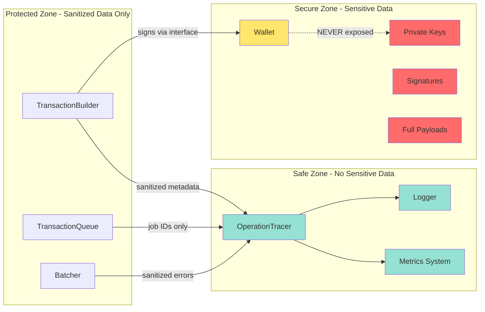

# PHP Blockchain Application Architecture

This document provides a visual overview of the PHP Blockchain package architecture using Mermaid diagrams.

**Last Updated:** 2025-11-08

## Changelog

### 2025-11-08 - TASK-006: Telemetry Hooks via OperationTracer
- Added `OperationTracerInterface` in `Blockchain\Telemetry` namespace
- Added `OperationTracer` concrete implementation with no-op defaults
- Extended tracer hooks: `onEnqueued()`, `onDequeued()`, `onBatchDispatched()`, `onBroadcastResult()`, `onTransactionBuilt()`
- Integrated tracer into `TransactionQueue` with lifecycle events
- Integrated tracer into `TransactionBuilder` with `withTracer()` method
- Updated `Batcher` to use new interface location
- Added comprehensive test coverage for telemetry hooks

---

## Overall Architecture



---

## Telemetry Architecture (TASK-006)



---

## Transaction Lifecycle with Telemetry



---

## Operations Module Class Diagram



---

## Driver Architecture



---

## Wallet Architecture



---

## Security Model (SEC-001 Compliance)



---

## Key Design Principles

1. **No-Op by Default**: All telemetry hooks are optional and have zero overhead when not used
2. **Immutability**: TransactionBuilder uses builder pattern with immutable configuration
3. **SEC-001 Compliance**: Private keys never leave wallet, sensitive data never logged
4. **Extensibility**: Custom tracers can be created by extending OperationTracer
5. **Type Safety**: Full PHP 8.2+ type hints on all methods and properties
6. **Testability**: All components support dependency injection and testing

---

## API Usage Examples

### Basic Tracer Usage

```php
use Blockchain\Telemetry\OperationTracer;
use Blockchain\Operations\TransactionQueue;

// No-op tracer (zero overhead)
$tracer = new OperationTracer();
$queue = new TransactionQueue(tracer: $tracer);
```

### Custom Tracer Implementation

```php
class MetricsTracer extends OperationTracer
{
    public function __construct(private MetricsCollector $metrics) {}

    public function onEnqueued(array $job): void
    {
        $this->metrics->increment('jobs.enqueued');
    }

    public function onBroadcastResult(array $result): void
    {
        if ($result['success']) {
            $this->metrics->increment('transactions.success');
        } else {
            $this->metrics->increment('transactions.failed');
        }
    }
}

$tracer = new MetricsTracer($metrics);
$builder = (new TransactionBuilder($driver, $wallet))->withTracer($tracer);
```

### Complete Lifecycle

```php
// Build transaction with tracer
$builder = (new TransactionBuilder($driver, $wallet))->withTracer($tracer);
$tx = $builder->buildTransfer('0x...', 1.0);
// → emits: onTransactionBuilt()

// Enqueue
$queue = new TransactionQueue(tracer: $tracer);
$queue->enqueue(new TransactionJob('tx-1', $tx['payload'], $tx['metadata']));
// → emits: onEnqueued()

// Batch process
$batcher = new Batcher($driver, $queue, tracer: $tracer);
$result = $batcher->dispatch();
// → emits: onDequeued(), traceBatchStart(), traceJobSuccess(), traceBatchComplete()
```

---

## Related Documentation

- [PRD.md](PRD.md) - Product Requirements Document
- [TESTING.md](TESTING.md) - Testing Guidelines
- [CONTRIBUTING.md](CONTRIBUTING.md) - Contribution Guidelines
- [plan/feature-core-operations-1.md](plan/feature-core-operations-1.md) - Operations Feature Plan
