# PHP Blockchain Integration Layer - Architecture Diagram

> **Auto-Generated Architecture Visualization**  
> Last Updated: 2025-11-08  
> This diagram is maintained by agents and should be updated whenever changes are made to the `src/` directory.

## Table of Contents
- [Overview](#overview)
- [High-Level Architecture](#high-level-architecture)
- [Core Components](#core-components)
- [Driver System](#driver-system)
- [Exception Hierarchy](#exception-hierarchy)
- [Utilities & Helpers](#utilities--helpers)
- [Operations Layer](#operations-layer)
- [Class Relationships](#class-relationships)
- [Method Flow Diagrams](#method-flow-diagrams)

---

## Overview

This document provides a comprehensive visual representation of the PHP Blockchain Integration Layer architecture. It shows all classes, interfaces, their relationships, key methods, and properties.

**Directory Structure:**
```
src/
├── BlockchainManager.php          # Main facade
├── Contracts/                     # Interfaces
│   └── BlockchainDriverInterface.php
├── Drivers/                       # Blockchain implementations
│   ├── EthereumDriver.php
│   └── SolanaDriver.php
├── Registry/                      # Driver management
│   └── DriverRegistry.php
├── Config/                        # Configuration
│   └── ConfigLoader.php
├── Transport/                     # HTTP layer
│   ├── HttpClientAdapter.php
│   └── GuzzleAdapter.php
├── Exceptions/                    # Error handling
│   ├── ConfigurationException.php
│   ├── TransactionException.php
│   ├── ValidationException.php
│   ├── UnsupportedDriverException.php
│   ├── ContractException.php
│   └── RpcException.php
├── Operations/                    # Transaction operations
│   ├── TransactionBuilder.php
│   └── TransactionQueue.php
├── Utils/                         # Utilities
│   ├── AddressValidator.php
│   ├── CachePool.php
│   ├── Serializer.php
│   ├── Abi.php
│   ├── Keccak.php
│   └── KeccakLib.php
└── Wallet/                        # Wallet interface
    └── WalletInterface.php
```

---

## High-Level Architecture


---

## Core Components

### BlockchainManager (Main Facade)


---

## Driver System

### Driver Implementations


---

## Exception Hierarchy

```mermaid
graph TB
    BASE[Exception<br/>PHP Base]
    
    CONFIG[ConfigurationException<br/>Invalid/Missing Config]
    UNSUP[UnsupportedDriverException<br/>Driver Not Available]
    TRANS[TransactionException<br/>Transaction Failures<br/>+getTransactionHash()]
    VALID[ValidationException<br/>Input Validation<br/>+getErrors()]
    CONTRACT[ContractException<br/>Smart Contract Errors<br/>+getContractAddress()]
    RPC[RpcException<br/>RPC Call Failures]
    
    BASE --> CONFIG
    BASE --> UNSUP
    BASE --> TRANS
    BASE --> VALID
    BASE --> CONTRACT
    BASE --> RPC
    
    style BASE fill:#F44336,stroke:#C62828,stroke-width:2px,color:#fff
    style CONFIG fill:#FF5722,stroke:#D84315,stroke-width:2px,color:#fff
    style UNSUP fill:#FF5722,stroke:#D84315,stroke-width:2px,color:#fff
    style TRANS fill:#FF5722,stroke:#D84315,stroke-width:2px,color:#fff
    style VALID fill:#FF5722,stroke:#D84315,stroke-width:2px,color:#fff
    style CONTRACT fill:#FF5722,stroke:#D84315,stroke-width:2px,color:#fff
    style RPC fill:#FF5722,stroke:#D84315,stroke-width:2px,color:#fff
```

### Exception Details


---

## Utilities & Helpers


---

## Operations Layer

### Transaction Operations


---

## Transport Layer


---

## Class Relationships

### Complete Dependency Graph


---

## Method Flow Diagrams

### Get Balance Flow

```mermaid
sequenceDiagram
    participant App as Application
    participant BM as BlockchainManager
    participant Driver as SolanaDriver/EthereumDriver
    participant Cache as CachePool
    participant HTTP as GuzzleAdapter
    participant RPC as Blockchain RPC
    
    App->>BM: getBalance(address)
    BM->>Driver: getBalance(address)
    
    Driver->>Cache: has(cacheKey)?
    alt Cache Hit
        Cache-->>Driver: return cached value
        Driver-->>BM: return balance
        BM-->>App: return balance
    else Cache Miss
        Driver->>HTTP: post(rpc_method, params)
        HTTP->>RPC: JSON-RPC Request
        RPC-->>HTTP: JSON-RPC Response
        HTTP-->>Driver: return data
        Driver->>Driver: convert units (lamports→SOL, wei→ETH)
        Driver->>Cache: set(cacheKey, balance, ttl)
        Driver-->>BM: return balance
        BM-->>App: return balance
    end
```



### Send Transaction Flow


### Transaction Builder Flow


### Driver Registry Flow


---

## Update Instructions for Agents

When making changes to the `src/` directory structure, please update this diagram according to the following rules:

### 1. Adding a New Class

1. Add the class to the appropriate section based on its namespace:
   - `Blockchain\` → Core Components
   - `Blockchain\Drivers\` → Driver System
   - `Blockchain\Exceptions\` → Exception Hierarchy
   - `Blockchain\Utils\` → Utilities & Helpers
   - `Blockchain\Operations\` → Operations Layer
   - `Blockchain\Transport\` → Transport Layer
   - `Blockchain\Config\` → Core Components
   - `Blockchain\Registry\` → Core Components

2. Update the class diagram with:
   - Class name
   - Key properties (with visibility and type)
   - Key methods (with parameters and return types)
   - Relationships (implements, extends, uses, depends on)

3. Update the dependency graph to show how the new class fits in

### 2. Adding a New Method

1. Add method to the appropriate class diagram
2. If the method is a major flow, add a sequence diagram
3. Update the overview if it changes how components interact

### 3. Adding a New Driver

1. Add driver class to "Driver System" section
2. Update the driver implementations diagram
3. Add driver to DriverRegistry default registrations
4. Update dependency relationships

### 4. Modifying Relationships

1. Update all diagrams showing the modified relationship
2. Update dependency graph
3. Update sequence diagrams if flow changes

### 5. Deprecating/Removing Components

1. Mark as deprecated in diagrams (add `[DEPRECATED]` suffix)
2. After removal, delete from all diagrams
3. Update dependencies to show new paths

### Example Update Format

```markdown
## Changelog

### 2025-11-08 - Initial Architecture Diagram
- Created comprehensive visualization of src/ directory
- Documented all classes, interfaces, relationships
- Added flow diagrams for key operations

### [Date] - [Change Description]
- [Details of what changed]
- [Which diagrams were updated]
```

---

## Changelog

### 2025-11-08 - Initial Architecture Diagram
- Created comprehensive Mermaid diagram for entire `src/` structure
- Documented 23 PHP files across 8 namespaces
- Added high-level architecture overview
- Documented all core components with methods and properties
- Created driver system visualization
- Documented complete exception hierarchy
- Added utilities and helpers documentation
- Created operations layer diagrams
- Added complete dependency graph
- Created 4 sequence diagrams for key flows:
  - Get Balance Flow
  - Send Transaction Flow
  - Transaction Builder Flow
  - Driver Registry Flow
- Added update instructions for agents

---

**Legend:**
- 🟢 Green: Entry points and facades
- 🔵 Blue: Interfaces and contracts
- 🟠 Orange: Implementations (Drivers)
- 🔴 Red: Exceptions
- → Dependency/usage relationship
- ⇢ Implementation relationship
- - - → Association

---

*This diagram is auto-updated by agents. Last manual review: 2025-11-08*
