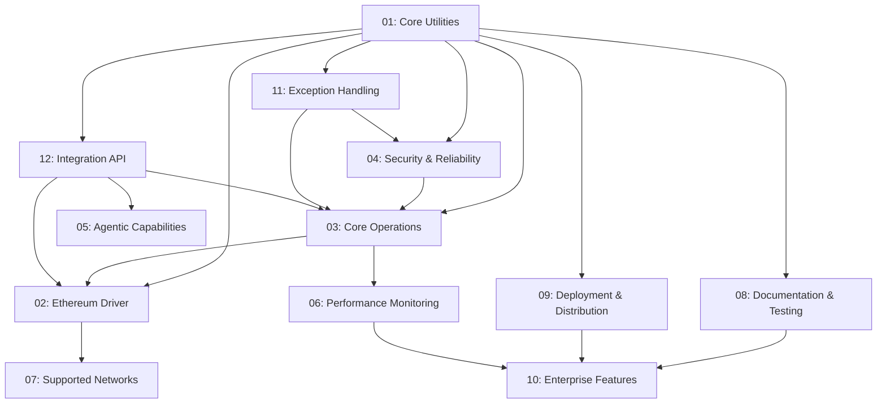

# PRD Breakdown — Major Epics

This document lists the major Epics identified from the top-level `PRD.md`.

## Phase 1 Epics

1. Core Utilities (Core Components, Interfaces, Registry)
2. Ethereum Driver (EVM driver implementation)
3. Core Operations (balances, transactions, token ops, gas estimation)
4. Security & Reliability (key management, validation, rate-limiting)
5. Agentic Capabilities (automated driver generation, docs, tests)
6. Performance & Monitoring (benchmarks, caching, connection pooling)
7. Supported Networks (Solana, Ethereum, Polygon, Near, Avalanche, etc.)
8. Documentation, Testing & QA (docs, unit/integration tests, CI)
9. Deployment & Distribution (composer packaging, CI/CD, releases)
10. Enterprise Features (HA, monitoring, compliance)
11. **Exception Handling & Error Management** (runtime recovery, retry, circuit breaker, error codes)
12. **Integration API & Internal Extensibility** (plugin system, service layer, event system, SOLID patterns)

> All Epic PRD files are available in the `docs/prd/` directory:
> - `01-CORE-UTILITIES-EPIC.md` through `12-INTEGRATION-API-EPIC.md`

### Epic Dependencies

### Recent Updates
- **2025-11-08**: Added Epic 11 (Exception Handling) and Epic 12 (Integration API) to Phase 1
  - Focus on runtime recovery mechanisms and internal extensibility
  - External framework integrations deferred to Phase 2
